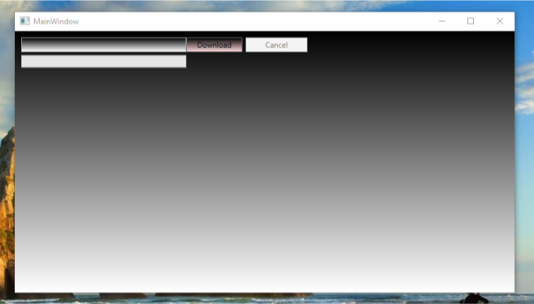
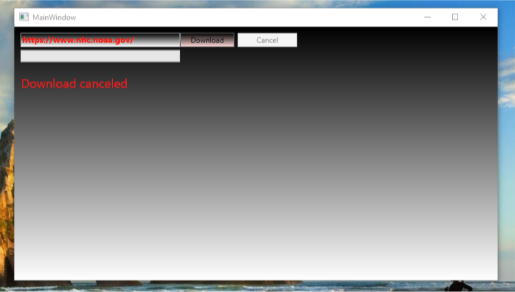
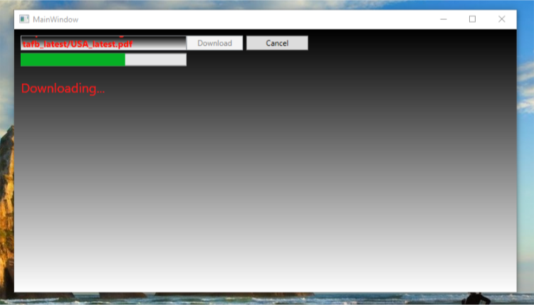

# Mic.Volo.Downloader
Downloader WPF application written in C#

## Using guide

### Steps
1. Enter URL adress
2. Push Download button
3. Choose download path

## Screenshots

## Author

Gurgen Mnatsakanyan - [Gurgennn](https://github.com/Gurgennn)
